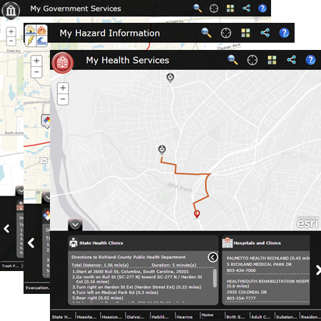

# my-government-services

***This my government services repo (JavaScript) been moved to mature support, applications built from this repo are in mature support. Check out the replacements to the apps below***

***My Government Services, My Hazard Information, and My Health Services solutions are now a configuration of the [Web appBuilder ](http://doc.arcgis.com/en/web-appbuilder/) and can be configured in ArcGIS Online without downloading the application. However, if you want to host the application on your own server or customize the Near Me widget then download the Web AppBuilder [(Developer Edition)](https://developers.arcgis.com/web-appbuilder/)***

   ***Check out the new [My Government Services](http://solutions.arcgis.com/local-government/help/my-gov-services/) solution***
   
   ***Check out the new [My Health Services](http://solutions.arcgis.com/state-government/help/health-services/) solution***
   
   ***Check out the new [My Hazard Information](http://solutions.arcgis.com/state-government/help/my-hazard-info/) solution***
   

The my-government-services repo contains three unique application configurations: **My Health Services, My Hazard Information, and My Government Services.**

**My Government Services** is a configuration of ArcGIS and a JavaScript application that helps residents locate a government facility and obtain information about curbside and drop-off services provided by a government agency. This application is typically used by residents in a community, but can be used by visitors to locate a library or post office near them. [Try the My Government Services application]

**My Hazard Information** is a configuration of ArcGIS and a JavaScript application that helps residents discover hazards that exist in their community and obtain information about evacuation routes and government facilities provided by a government agency. [Try the My Hazard Information application]

**My Health Services** is a configuration of ArcGIS and a JavaScript application that helps residents locate a health facility and obtain information about services provided within their community.[Try the My Health Services application]

[]

## Features

* Search for an address
* Locate a facility
* Obtain information about services
* Share information using social media

## Requirements

**Start now using your own services then update the configuration files**

For more information on requirements, publication steps, and app configuration see [My Government Services](http://links.esri.com/localgovernment/help/10.2/MyGovernmentServices) help or [My Hazard Information](http://links.esri.com/localgovernment/help/10.2/MyHazardInformation) help

Once you have completed these steps, you can start using the application now by setting it up on a web server running Microsoft Internet Information Services (IIS) and using sample services supplied by Esri.
You'll need to convert to an application in IIS and use the ASP .NET 4.0. application pool.

## Resources

Learn more about Esri's [ArcGIS for State and Local Government maps and apps](http://solutions.arcgis.com).

Show me a list of other [State and Local Government GitHub repositories](http://esri.github.io/#Government).

This application uses the 3.11 version of
[Esri's ArcGIS API for JavaScript](http://help.arcgis.com/en/webapi/javascript/arcgis/);
see the site for concepts, samples, and a reference for using the API to create mapping web sites.

## Selecting Your Configuration
The my-government-services repo contains three unique application configurations: My Health Services, My Hazard Information, and My Government Services.

Using the default files you will get the My Government Services configuration of the application (config.js and default.htm). To get the My Health Services configuration rename configHealthServices.js to config.js and rename defaultMyHealth.htm to default.htm. To get the My Hazard Information configuration rename configHazardInfo.js to config.js and rename defaultMyHazard.htm to default.htm.

## Issues

Find a bug or want to request a new feature?  Please let us know by submitting an issue.

## Contributing

Esri welcomes contributions from anyone and everyone.
Please see our [guidelines for contributing](https://github.com/esri/contributing).

## Licensing

Copyright 2013 Esri

Licensed under the Apache License, Version 2.0 (the "License");
you may not use this file except in compliance with the License.
You may obtain a copy of the License at

   http://www.apache.org/licenses/LICENSE-2.0

Unless required by applicable law or agreed to in writing, software
distributed under the License is distributed on an "AS IS" BASIS,
WITHOUT WARRANTIES OR CONDITIONS OF ANY KIND, either express or implied.
See the License for the specific language governing permissions and
limitations under the License.

A copy of the license is available in the repository's
[LICENSE.txt](LICENSE.txt) file.

